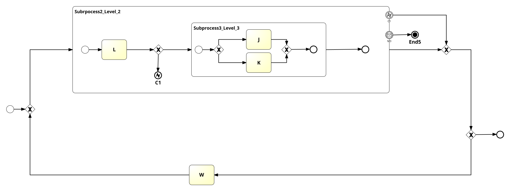
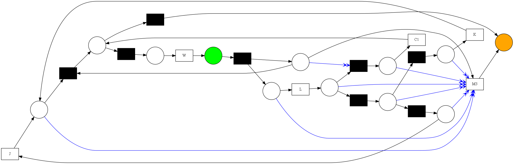
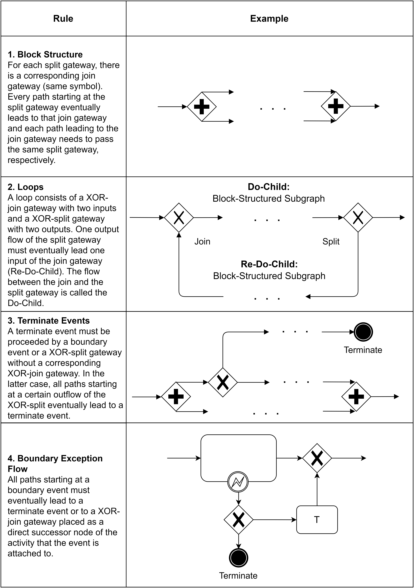

# PM4Py Resetnet
PM4Py Resetnet is a fork based on the PM4PY library. It has the goal to provide a mapping from BPMN
to reset nets which require less modeling overhead than Petri nets. 
The speiality of the approach lies in the support for BPMN models with cancellation features.
Thus, a user can import a BPMN model, translate it to a language-equivalent reset net and apply further
analysis on it.


## Example
A very simple example how a model with cancellation features is mapped:

```python
import os
from pm4py.objects.bpmn.importer import importer as bpmn_importer
from pm4py.objects.conversion.bpmn import converter as reset_net_converter
from pm4py.visualization.petri_net import visualizer as pn_visualizer

bpmn_graph = bpmn_importer.apply(os.path.join("tests","input_data","cancellation.bpmn"))
parameters = {}
# should the amount of reset arcs be minimized wherever possible?
parameters["optimize"] = True
# should boundary events be treated as labelled activities?
parameters['include_events'] = True
reset_net, initial_marking, final_marking = reset_net_converter.apply(bpmn_graph, 
variant=reset_net_converter.RESET_VARIANT, parameters=parameters)

gviz = pn_visualizer.apply(reset_net, initial_marking, final_marking)
pn_visualizer.view(gviz)
```

Input BPMN model:\



Output reset net:\


## Supported Features
* XOR-,AND-,OR-gateways (block-structured)
* One start event per (sub)process
* One normal end event per (sub)process
* Internal cancellation, e.g., error end event inside subprocess + corresponding boundary event attached to subprocess
* External cancellation, e.g., intermediate message event attached to subprocess (without corresponding end event inside subprocess)
* Terminate end events

The mapping requires that the input BPMN models fulfil certain structural requirements. In general, only semi-block-structured models are supported.
For other model types, a proper mapping cannot be guaranteed. Also, note that message flows are not supported.
The definition for semi-block-structuredness can be given by fulfilling the following rules: \



## Difference to PM4PY original work
The following files differ from the original library:
*  `pm4py/objects/bpmn/importer/variants/lxml.py`
*  `pm4py/objects/bpmn/exporter/variants/etree.py`
*  `pm4py/objects/bpmn/obj.py`
*  `pm4py/objects/bpmn/util/__init__.py`
*  `pm4py/objects/petri_net/utils/petri_utils.py`
*  `pm4py/objects/petri_net/utils/reduction.py`
*  `pm4py/objects/conversion/bpmn/variants/__init__.py`
*  `pm4py/objects/conversion/bpmn/converter.py`
*  `pm4py/objects/conversion/bpmn/variants/to_reset_net.py`
*  `pm4py/objects/conversion/bpmn/util/bpmn_utils.py`
*  `pm4py/objects/conversion/bpmn/util/block_structure.py`
*  `bpmn_mapping_example.py`


 `indicates changes to existing file`
 `indicates new file`
